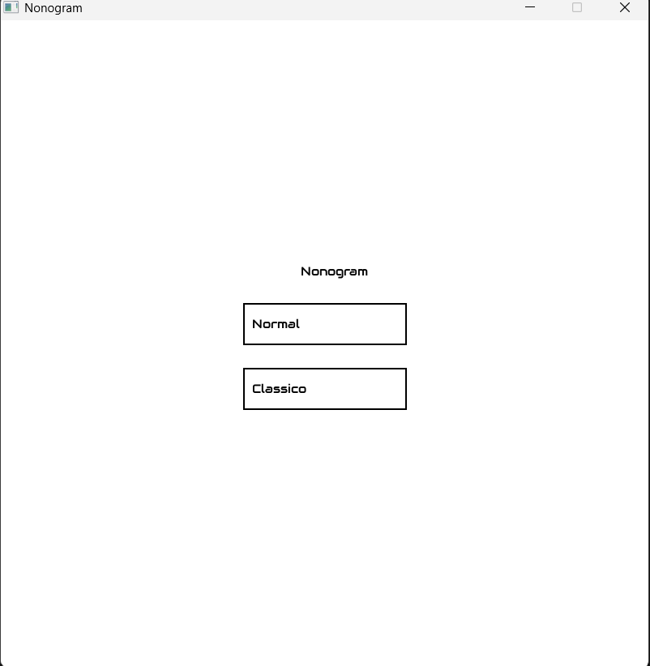
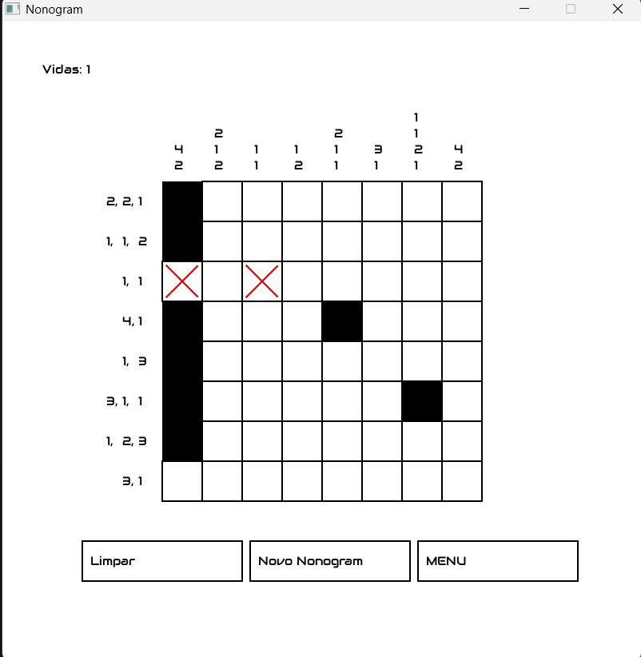
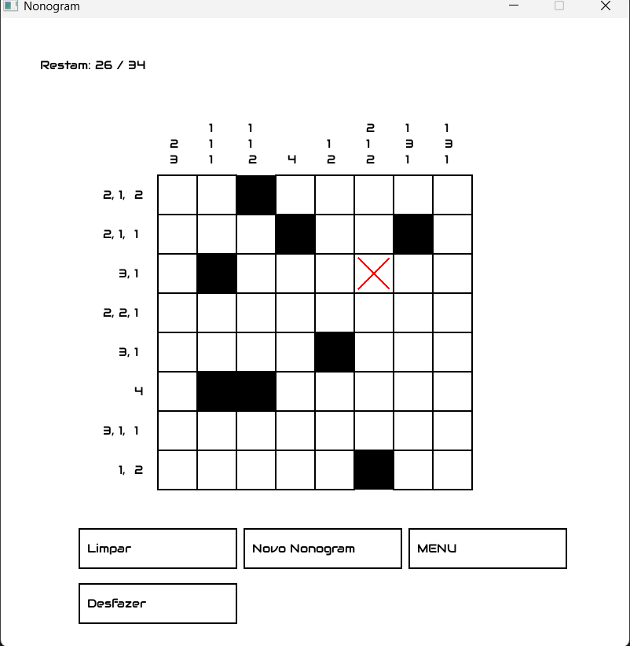
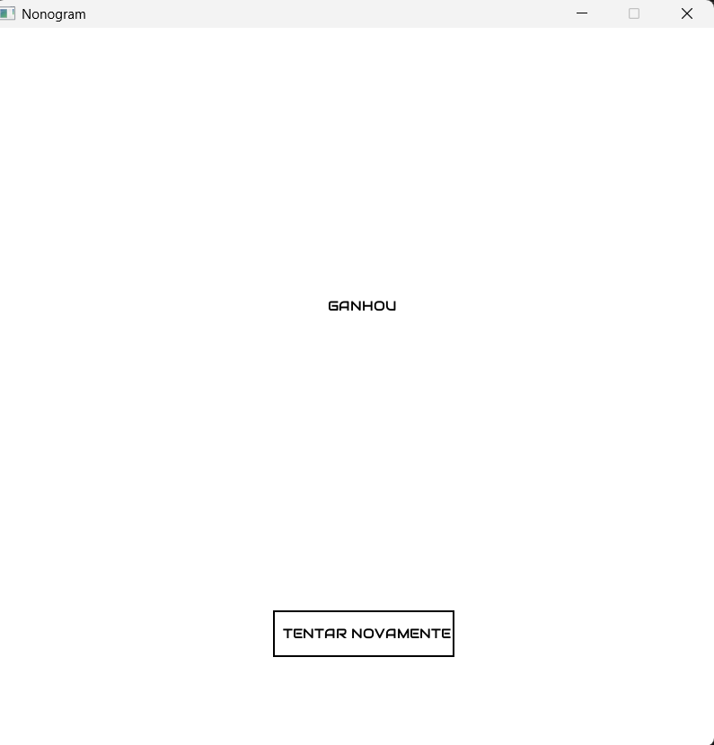
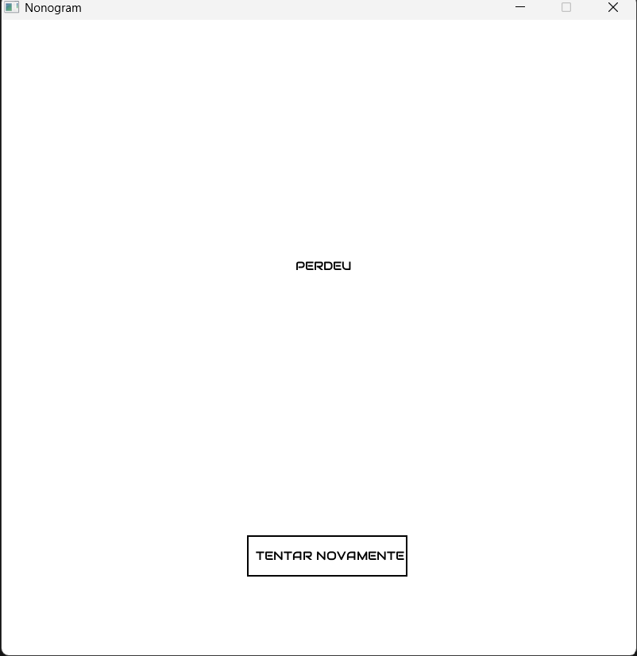

# Nonogram

Implementação do jogo **Nonogram (Picross)** em C utilizando a biblioteca gráfica **Allegro 5**.

## Sobre o Projeto

Nonogram é um jogo de lógica em que o objetivo é descobrir quais células devem ser preenchidas utilizando apenas as pistas numéricas fornecidas nas linhas e colunas.

Cada número indica a quantidade de células consecutivas preenchidas naquela linha ou coluna.

Este projeto foi desenvolvido como trabalho acadêmico para praticar conceitos de:

- Programação em C
- Matrizes bidimensionais
- Structs
- Enums
- Manipulação de eventos
- Interface gráfica com Allegro 5
- Organização de código

---

## Funcionalidades

### Modo Normal

- Sistema de vidas
- Erros consomem vidas
- Células incorretas são marcadas automaticamente com "X"
- Tela de vitória
- Tela de derrota

### Modo Clássico

- Marcação manual de células
- Ciclagem de estados:
  - Vazio
  - Preenchido
  - Marcado com X
- Sistema de desfazer jogadas
- Contador de progresso
- Sem limite de vidas

### Recursos Gerais

- Geração aleatória de Nonograms
- Botão para limpar tabuleiro
- Botão para gerar novo puzzle
- Retorno ao menu principal
- Interface gráfica utilizando Allegro 5

---

## Capturas de Tela

### Menu 

Tela inicial do jogo, permitindo escolher entre o Modo Normal e o Modo Clássico.

### Modo Normal

Modo com sistema de vidas, onde erros são penalizados e células incorretas são marcadas automaticamente.

### Modo Clássico

Modo tradicional de Nonogram, com marcação manual das células, contador de progresso e sistema de desfazer jogadas.

### Vitória

Exibida quando o jogador completa corretamente o puzzle.

### Derrota

Exibida quando o jogador perde todas as vidas no Modo Normal.
